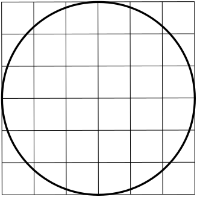
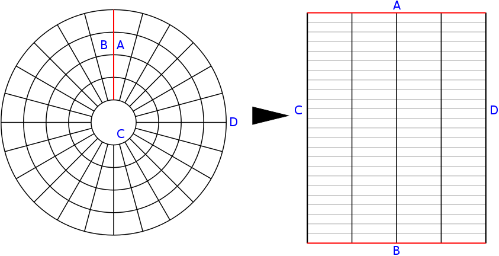

====================
Multi-Block
====================

A Brief Introduction to MB domains
==================================

Logically structured grids are a simply connected N-Dimensional
Cartesian space. Simply put, the best way to store data in memory is
as a continuous block indexed via standard Cartesian coordinates. The
Mulit-Block(MB) domain type allows mapping of the logical space to
a more complicated physical space. Consider a simple example: a
2D circular domain.

Representing this plane on a structured Cartesian grid is immediately
problematic.

   
   A circular simulation space on a Cartesian grid.

The edges of the domain don't map cleanly to the edge of the
coordinates. Clearly we should be using a different coordinate
system, a polar grid.

.. figure::  images/circle_on_polar.png
   :align:   center
   
   A circular simulation space on a polar grid.

This representation is much more natural. (Obviously there are some
issues at the center of the circle. The handling of this coordinate
singularity won't be discussed here.) The MB domain type includes the
fundamental components needed to translate the logical grid to this (and other) physical
coordinates: :ref:`block mappings <cylindrical_block_tutorial>` and
:ref:`trafos <cylindrical_trafo_tutorial>`.

.. _cylindrical_block_tutorial:

Better Boundaries through Blocks
--------------------------------

A square has four boundaries (which we'll call faces): top, bottom, left, and right. The
circular domain pictured above, however, only has one physical 'face'
(the circumference). The polar coordinate system gives us a second
computational 'face' as :math:`r \rightarrow 0`, since the radius is always greater
than zero. The first step to map our circular physical space to
logical cartesian space is to make the number of faces the same. We'll
make a radial cut and unroll the domain, creating two new faces which
we'll label **A** and **B**. At the same time, we'll label the inner
and outer faces **C** and **D**. 

   
   Unrolling the circle.

Clearly **A** and **B** need to map to each other, ie they communicate 
with each other and exchange ghost points. **D** is some outer
boundary, so it doesn't need to map to any other face. **C**, however,
is a special case. Any point on **C** will map to a different point on
**C**. To better implement this, let's make another cut and seperate
our domain into two **blocks**.

.. figure::  images/block_step_2.png
   :align:   center
   
   Add a second cut.

We've added two new faces, **E** and **F** (which trivially map to
each other), and split **C** and **D** into two faces each. **D0** and
**D1** are still outer boundaries, so they don't need any
mappings. **C0** and **C1** will map to the reverse of each other,
i.e. The corner **C0/A** maps to **C1/B** and visa-versa. By splitting
our cylindrical domain into two blocks and unrolling it we now have
created a table that maps the physical domain into Cartesian logical
space:

=======  ====== ======= ==========
Block    Face   Maps to Reversed?
=======  ====== ======= ==========
0        A      B       no
0        C0     C1      yes
0        D0     none    no
0        E      F       no
1        B      A       no
1        C1     C0      yes
1        D1     none    no
1        F      E       no
=======  ====== ======= ==========

This division of the simulation to blocks which are mapped in
logical cartesian space gives the Multi-Block domain its name. In
``libmrc`` these mappings are generated by helper objects to
``mrc_domain`` called ``block_factories``. Several predefined block
factories exist, and the process for constructing new mappings is
discussed here. FIXME ADD A LINK

User Interface
===============

.. c:type:: struct mrc_domain_mb

   :param param_string block_factory: The type of the :c:type:`mrc_block_factory` which
				      should be used during setup to create
				      the block mappings.

   :param param_int3 ppb: Number of patches per block in patch local x, y, and z directions. Total number of
			  patches must be greater than or equal to the number of MPI
			  processors.

      .. note:: The directions [x,y,z] corresponding
		to the coordinate indices [0,1,2], the
		option parser just treats all `int[3]`
		params like they were Cartesian.
      
   :methods:

      .. c:function:: void get_trafo(struct mrc_domain *domain, struct mrc_trafo **trafo)

          Recover the pointer to the :c:type:`mrc_trafo` associated with this domain.

